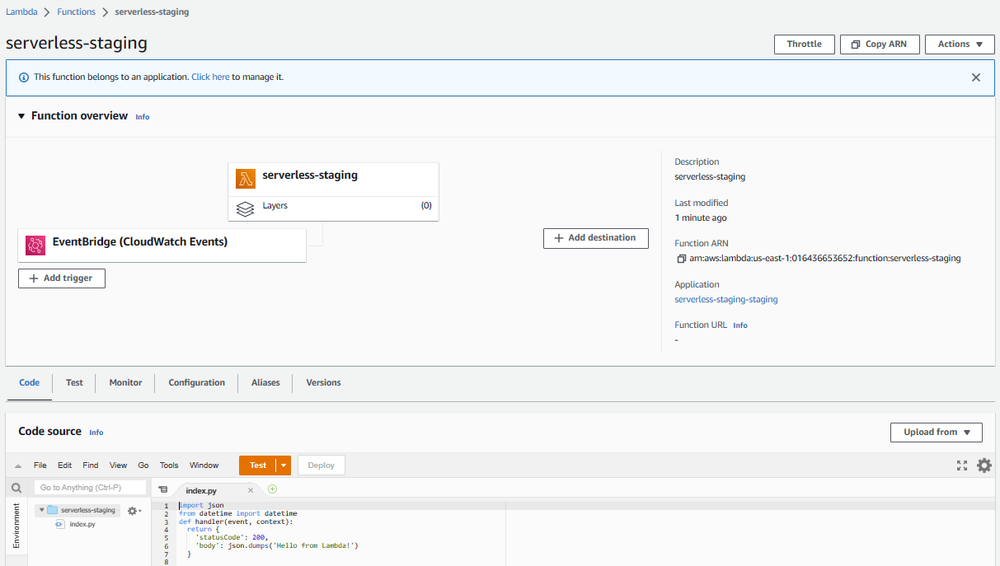

# Serverless Framework Invoke Lambda On CloudWatch Events

## Description
Walkthrough on Serverless Framework (sls) Invoke Lambda Function Scheduling with CloudWatch Events
 
## Overview
In this exercise, we will learn how to use `Serverless Framework` with `CloudWatch Events` which invoke AWS `Lambda Function` in regular intervals.
Here are the steps.

### Step - 1
----
First, we assume that you have already set the AWS credentials in your local machine. Let’s see how we can get data from the S3 to Python as Pandas Data Frames with AWS Data Wrangler. I have an S3 bucket that contains the `customers.csv` data in `input` folder.


### Step - 2
----
Create a serverless framework project on your linux machine and edit the `serverless.yml` file with the given code.

``` yaml
# Welcome to Serverless!
#
# This file is the main config file for your service.
# It's very minimal at this point and uses default values.
# You can always add more config options for more control.
# We've included some commented out config examples here.
# Just uncomment any of them to get that config option.
#
# For full config options, check the docs:
#    docs.serverless.com
#
# Happy Coding!
 
service: ${self:custom.product}-${self:provider.stage}
 
#useDotenv: true
 
# app and org for use with dashboard.serverless.com
#app: your-app-name
#org: your-org-name
 
# You can pin your service to only deploy with a specific Serverless version
# Check out our docs for more details
frameworkVersion: '3'
 
# you can overwrite defaults here
provider:
  name: aws
  region: ${opt:region, 'us-east-1'}                        # change to your region as required
  stage: ${opt:stage, 'staging'}                            # development, stagging, testing, production
#  profile: ${opt:aws-profile, 'ServerlessUser'}
  stackTags:
    Env: ${self:provider.stage}
 
# you can define your custom resources here
custom:
  S3BucketName: bucket-name                                 # provide your bucket unique name
  product: serverless                                       # you can change your product as required like lambda, S3, etc.
 
# Resources section defines metadata for the Resources.
# Create IAM Role assumed by the crawler. For demonstration, this role is given all related permissions.
resources:
  Resources:
    AWSLambdaFunctionRole:
      Type: AWS::IAM::Role
      Properties:
        AssumeRolePolicyDocument:
          Version: "2012-10-17"
          Statement:
            - Effect: "Allow"
              Principal:
                Service:
                  - "lambda.amazonaws.com"
              Action:
                - "sts:AssumeRole"
        Path: "/"
        Policies:
          - PolicyName: AWSLambdaAccess
            PolicyDocument:
              Statement:
                - Effect: Allow
                  Action: lambda:*
                  Resource: '*'
          - PolicyName: AWSS3Access
            PolicyDocument:
              Statement:
                - Effect: Allow
                  Action:
                    - s3:*
                    - s3-object-lambda:*
                  Resource: '*'
          - PolicyName: AWSCloudWatchLogsAccess
            PolicyDocument:
              Statement:
                - Effect: Allow
                  Action:
                    - logs:*
                  Resource: '*'
 
# Create a database to contain tables created by the crawler.
    AWSLambdaFunction:
      DependsOn:
        - AWSLambdaFunctionRole
      Type: AWS::Lambda::Function
      Properties:
        FunctionName: ${self:custom.product}-${self:provider.stage}
        Description: ${self:custom.product}-${self:provider.stage}
        Runtime: python3.9
        MemorySize: 256
        Timeout: 5
        Role:
          Fn::GetAtt:
          - AWSLambdaFunctionRole
          - Arn
        Handler: index.handler
        Code:
          ZipFile: |
              import json
              from datetime import datetime
              def handler(event, context):
                return {
                  'statusCode': 200,
                  'body': json.dumps('Hello from Lambda!')
                }
        TracingConfig:
          Mode: Active
   
    LambdaFunctionSchedule:
        Type: AWS::Events::Rule
        Properties:
          ScheduleExpression: cron(0/5 * * * ? *)
          Targets:
            - Arn:
                Fn::GetAtt:
                  - AWSLambdaFunction
                  - Arn
              Id: '1'
 
    LambdaFunctionPermission:
        Type: AWS::Lambda::Permission
        Properties:
          Action: lambda:InvokeFunction
          FunctionName:
            Fn::GetAtt:
              - AWSLambdaFunction
              - Arn
          Principal: events.amazonaws.com
          SourceArn:
            Fn::GetAtt:
              - LambdaFunctionSchedule
              - Arn
```

Deploy your project with the command as

``` sh
sls deploy
```


This takes some time to complete.


Further verify your stack from AWS `CloudFormation` console.


Check your function in AWS Lambda console.




Also you can check the event in `CloudWatch` `Events` and `Rules`.


Check the logs in CloudWatch


### Step - 4
----
Finally, we clean-up the resources so that we don’t incur any cost with the command

``` sh
sls remove
```


- Delete `Logs` from `Log groups` in the AWS CloudWatch console.
